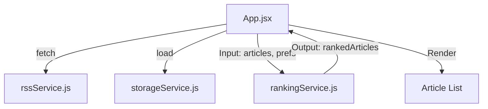

# Plan: On-Device Ranking Algorithm

**Epic:** 2.1 - Client-Side Ranking Algorithm  
**Spec:** [spec.md](file:///mnt/Storage/Documents/Projects/EdgeReader/specs/021-ranking-algorithm/spec.md)

---

## Architecture Overview

We will implement a stateless `rankingService.js`. The logic will be purely functional, taking current articles and user preferences as input and returning a sorted array.

### Component Diagram (Logical)



---

## Scoring Implementation Detail

### Algorithm Pseudo-code

```javascript
function scoreArticle(article, prefs) {
    let score = 0;
    
    // 1. Recency (100 pts max)
    const ageHours = (Date.now() - article.publishDate) / 3600000;
    score += Math.max(0, 100 - ageHours);
    
    // 2. Topic Match (50 pts)
    if (prefs.selectedTopics.has(article.topic)) score += 50;
    
    // 3. Source Priority
    if (prefs.disabledSources.has(article.source)) return -1000;
    if (prefs.enabledSources.has(article.source)) score += 30;
    
    // 4. Keyword Match (20 pts per match, cap 60)
    let kwBonus = 0;
    const text = (article.title + " " + article.description).toLowerCase();
    prefs.keywords.forEach(kw => {
        if (text.includes(kw.toLowerCase())) kwBonus += 20;
    });
    score += Math.min(60, kwBonus);
    
    return score;
}
```

---

## Testing Plan

### Automated Verification
Since the algorithm is deterministic, we will implement a browser-based test suite (using the browser subagent) to verify the scoring logic.

**Test Scenarios:**
1. **Source Exclusion:** Verify articles from "Reuters Tech" are gone when disabled.
2. **Topic Boost:** Verify "Technology" articles appear before "General" articles of similar age.
3. **Keyword Boost:** Verify articles containing "AI" increase in rank when the "AI" keyword is added.
4. **Recency:** Verify a 1-hour old article is ranked higher than a 5-hour old article from the same source.

### Performance Benchmarking
- Measure execution time for 400 articles using `performance.now()`.
- Log time to console.

---

## AC Verification Mapping

| AC | Verification Method |
|----|---------------------|
| AC-2.1.1 (Recency) | Browser test: Filter by source, check top 2 items for date order. |
| AC-2.1.2 (Topic) | Browser test: Add topic to prefs, check if articles with that topic move up. |
| AC-2.1.3 (Keyword) | Browser test: Add keyword "Apple", check rank of items mentioning Apple. |
| AC-2.1.4 (Filtering) | Browser test: Disable source, check article list length and content. |
| AC-2.1.5 (Performance)| Browser test: Console log `performance.now()` delta. |

---

## Rollout Notes

1. Create `src/services/rankingService.js`.
2. Update `App.jsx` to load preferences on mount.
3. Update `App.jsx` to pass articles through `rankArticles` before rendering.
4. Verify initial ranking with default preferences (Tech/Science favored).
